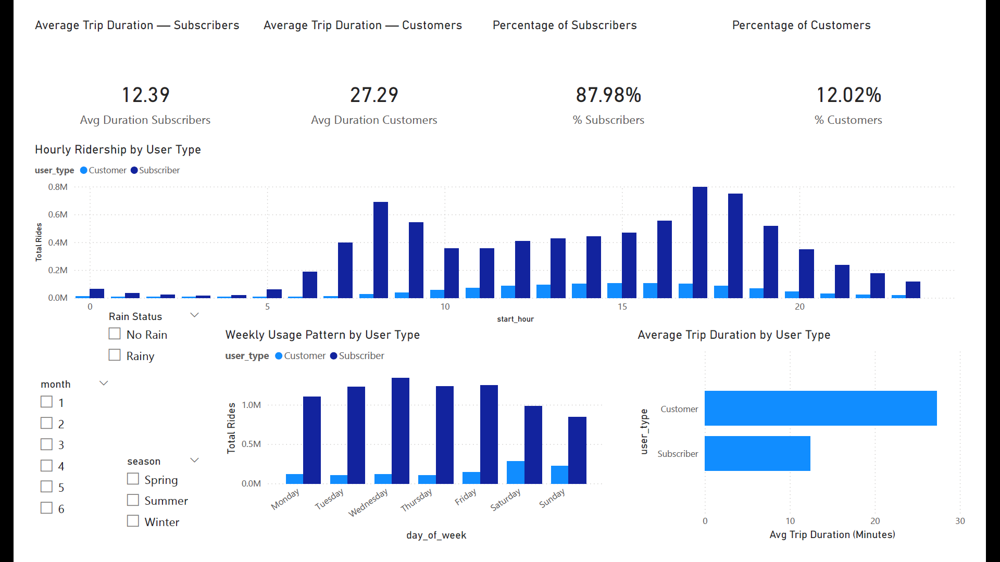
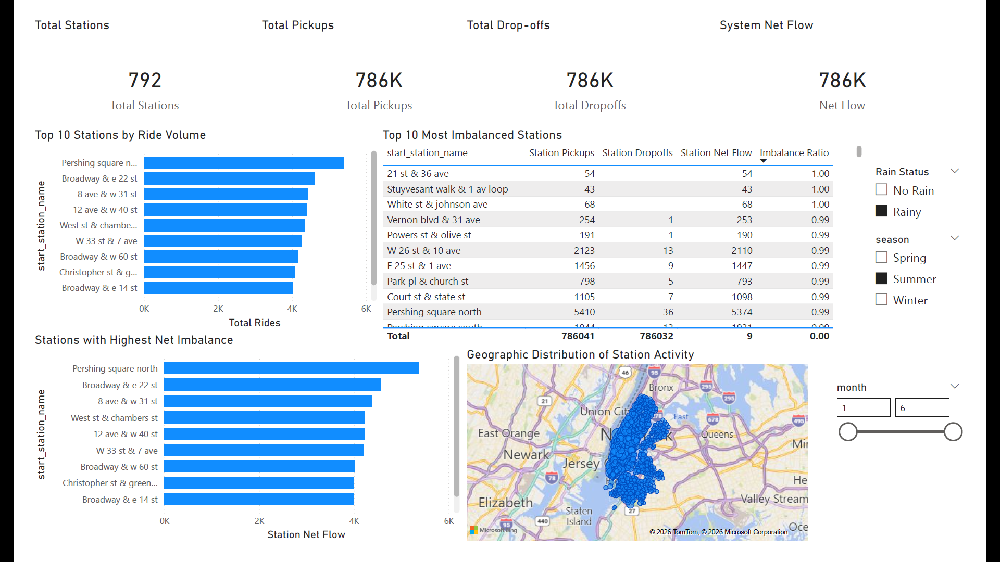
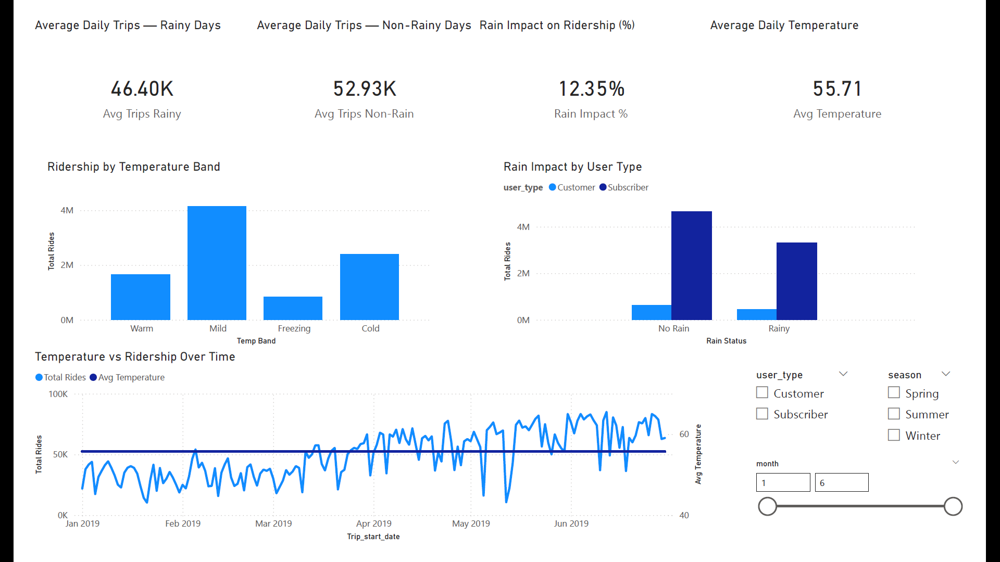

# 🚲 CitiBike & NYC Weather Data Analysis  
### End-to-End SQL Pipeline & Power BI Report Development  

---

## 📌 Executive Summary

This project analyzes **9M+ CitiBike trip records (January–June 2019)** integrated with **NYC weather data (2019)** to transform raw operational data into actionable business insights.

Using a structured SQL pipeline and multi-page Power BI reports, the project evaluates:

- Ridership trends  
- Weather impact on demand  
- Subscriber vs Customer behavior  
- Station-level imbalance  

The goal is to support operational planning, demand forecasting, and bike redistribution strategy.

---

# 🧠 Business Problem & Impact

Urban bike-sharing systems generate millions of records daily, but raw data alone does not answer:

- When does demand peak?
- Which stations experience imbalance?
- How does weather affect ridership?
- Are customers and subscribers behaving differently?

This project builds a validated analytical framework that converts trip-level data into KPI-driven operational insights.

### Operational Impact

**Demand Forecasting**
- Identified hourly and weekday peak patterns  
- Measured 50K+ average daily rides  

**Weather-Adjusted Planning**
- Rain reduces ridership by ~12%  
- Customers show higher weather sensitivity  
- Warmer temperatures correlate with higher demand  

**Station Rebalancing**
- Identified high-volume and high-imbalance stations  
- Quantified net flow per station  

**User Segmentation**
- Subscribers exhibit commuter patterns  
- Customers take longer leisure trips  

---

# 🏗 Architecture & Data Pipeline

Structured workflow:

Raw Data → Staging → Cleaning → Validation → Analysis → KPI Layer → Power BI Reports

---

## 🗄 Database Layer (MySQL)

### Raw Data
- 9M+ CitiBike trip records  
- NYC daily weather dataset  

### Staging
- Column normalization  
- Data type corrections (TEXT → DATE, DATETIME, DECIMAL, YEAR)  
- Date/time extraction  
- Hour, weekday, month, season derivation  

### Feature Engineering
- Average temperature calculation  
- Rain classification  
- Rider age derivation  
- Station pickup/dropoff aggregation  
- Net flow & imbalance metrics  

---

## 🧹 Data Cleaning & Validation

Performed integrity checks including:

- Duplicate ride detection  
- Invalid birth year correction  
- Null station ID removal  
- Outlier removal (> 24 hours)  
- Recalculated trip_duration from timestamps  
- Timestamp validation  
- Null audits  
- Weather duplicate checks  
- Join completeness validation  

---

## ⚙ Performance Handling

Due to dataset size (9M+ rows):

- Keep-Alive Timeout increased to 1200 seconds  
- Connection Timeout increased to 1200 seconds  
- Read Timeout increased to 1200 seconds  

Ensured stable execution of large aggregation queries.

---

# 📊 SQL Analytical Coverage

Analysis includes:

- Total rides  
- Average trip duration  
- Hourly ridership distribution  
- Weekly ridership patterns  
- Monthly trends  
- User-type distribution  
- Gender distribution  
- Top 10 stations  
- Station imbalance  
- Weather impact  
- Rain impact by user type  
- Trip duration vs temperature  

---

# 📈 Power BI Reports

Data retrieved via ODBC from MySQL and modeled using a star schema.

---

## 📸 Report Preview

*(Place screenshots in a `/docs` folder)*

### 1️⃣ Ridership Overview

### 2️⃣ User Behavior Analysis

### 3️⃣ Station Performance

### 4️⃣ Weather Impact Analysis

---

# 🛠 Tools & Technologies

- SQL  
- MySQL  
- MySQL Workbench  
- ODBC Connector  
- Power BI  
- DAX  
- Star Schema Modeling  

---

# 🚀 Quick Start (Reproducibility)

## Prerequisites
- MySQL Server 8.0+
- MySQL Workbench
- MySQL ODBC Connector
- Power BI Desktop
- CitiBike (Jan–June 2019) CSV files
- NYC Weather 2019 CSV file

---

## Setup Steps

1. Run `01_Database_Setup.sql`
2. Execute `02 Raw data.sql`
3. Run `03 Staging.sql`
4. Execute `04 Data Cleaning.sql`
5. (Optional) Run `05 Analysis Queries.sql` and `06 KPI Queries.sql`
6. Open the `.pbit` file in Power BI
7. Connect via ODBC to MySQL
8. Load:
   - `citibike_staging`
   - `nyc_weather_staging`

Power BI will rebuild the reports.

---

# 💼 Skills Demonstrated

- Large-scale data handling (9M+ records)  
- Structured SQL pipeline design  
- Data cleaning & validation  
- Feature engineering  
- Analytical SQL querying  
- KPI construction  
- ODBC integration  
- Star schema modeling  
- DAX measure development  
- Multi-page Power BI report design  
- Operational insight extraction  

---

# 📚 Data Sources

Raw datasets not included due to size:

- CitiBike System Data: https://citibikenyc.com/system-data  
- NOAA Weather Data: https://www.ncdc.noaa.gov/  

---

## 👤 Author

Nithish Sunkara
