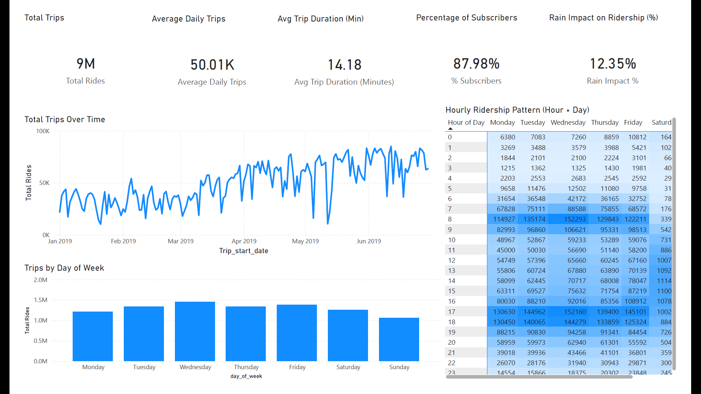
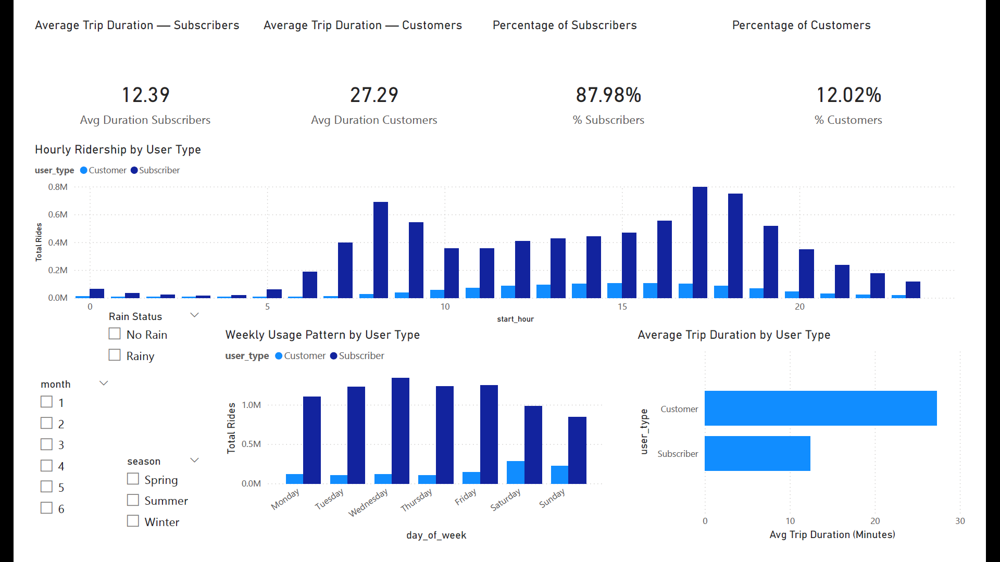
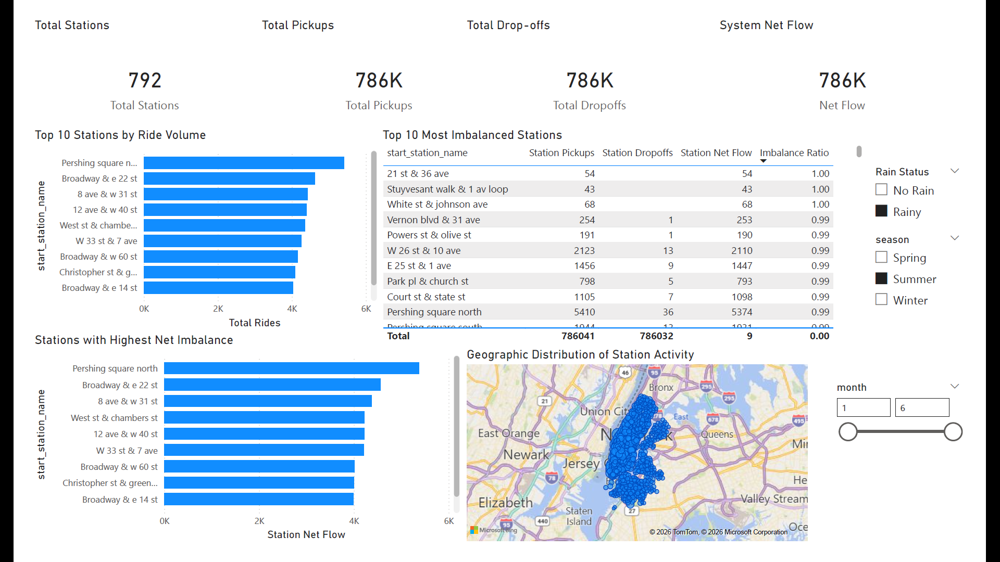
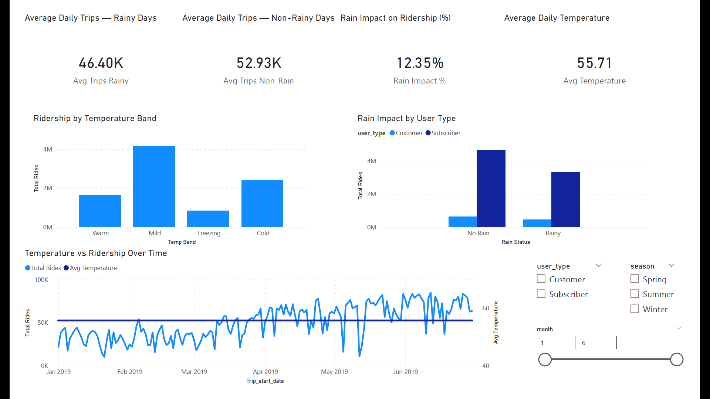

# 🚲 CitiBike & NYC Weather Data Analysis
### End-to-End SQL Pipeline & Power BI Report Development
---

## 📌 Executive Summary
This project analyzes **9M+ CitiBike trip records (January–June 2019)** integrated with **NYC weather data (2019)** to transform raw operational data into actionable business insights. Using a structured SQL pipeline and multi-page Power BI reports, the project evaluates ridership trends, weather impacts on demand, and station-level imbalances to support operational planning and demand forecasting.
---

# 🧠 Business Problem & Impact
Urban bike-sharing systems generate millions of records daily, but raw data alone doesn't optimize operations. This project builds a validated analytical framework to answer:
* **When does demand peak?** (Hourly and weekday patterns)
* **Which stations experience imbalance?** (Identifying net flow issues)
* **How does weather affect ridership?** (Quantifying rain and temperature sensitivity)
* **How do user behaviors differ?** (Segmenting Subscribers vs. Casual Customers)

### Data-Driven Insights
* **Demand Forecasting:** Measured an average of 50K+ daily rides with distinct commuter peaks.
* **Weather Sensitivity:** Rain reduces ridership by ~12%, with casual customers showing significantly higher sensitivity than subscribers.
* **Station Management:** Identified high-volume "hotspots" to quantify net flow and inform rebalancing strategies.

---

# 🏗 Architecture & Data Pipeline
**Workflow:** Raw Data → Staging → Cleaning → Validation → Analysis → KPI Queries → Power BI Reports

---

## 🗄 Database Layer (MySQL)

### Staging & Transformation
Performed structured transformations including:
* **Data Type Corrections:** Converted raw text to `DATE`, `DATETIME`, `DECIMAL`, and `YEAR`.
* **Feature Engineering:** Derived analytical fields such as `trip_start_hour`, `day_of_week`, `season`, and `rider_age`.
* **Weather Integration:** Calculated daily average temperatures and categorized precipitation levels.
* **Operational Metrics:** Aggregated station pickups/dropoffs to calculate **Net Flow** and **Imbalance Metrics**.

### 🧹 Data Cleaning & Validation
Ensured 100% data integrity through:
* **Outlier Removal:** Filtered trips exceeding 24 hours and corrected invalid birth years (e.g., records from 1885).
* **Integrity Audits:** Removed null station IDs and performed join-completeness validation between trip and weather data.
* **Consistency Checks:** Validated timestamps and ensured no negative precipitation values.

---

# 🛠 Technical Challenges & Solutions

### 1. High-Volume Data Processing (9M+ Rows)
**Challenge:** Standard MySQL configurations led to "Lost Connection" errors and execution timeouts during the staging and transformation of the 9-million-row dataset.
**Solution:** Optimized the database environment by increasing `net_read_timeout`, `net_write_timeout`, and `wait_timeout` to **1200 seconds**. This ensured stable execution for complex joins and multi-layered aggregations without system interruption.

### 2. Data Integrity & "Dirty" Sensor Data
**Challenge:** The raw dataset contained several anomalies, including "ghost trips" (trips over 24 hours) and invalid birth years.
**Solution:** Implemented a robust SQL cleaning script that utilized conditional filtering and data validation checks. I established a "Staging-to-Clean" pipeline that ensured only verified records reached the final Power BI model.

### 3. Cross-Dataset Integration
**Challenge:** Merging trip-level data with daily weather data required careful timestamp alignment, as weather was recorded daily while trips were recorded by the second.
**Solution:** Engineered a date-standardization layer in SQL, extracting a unified `trip_start_date` from the timestamps to serve as a high-performance **Join Key**. This allowed for seamless correlation analysis between precipitation levels and ridership volume.

---

# 📊 SQL Analytical Coverage
Custom queries were developed to evaluate:
* **Time-Series Analysis:** Monthly, weekly, and hourly ridership distributions.
* **Demographic Segmentation:** User-type and gender distribution analysis.
* **Geospatial Insights:** Top 10 stations by volume and net flow imbalance.
* **Weather Correlation:** Impact of rain and temperature on trip duration and frequency.

---

# 📈 Power BI Reports
Data is retrieved via **ODBC from MySQL** and modeled using a **Star Schema** for optimal DAX performance.

### 📸 Report Preview

### 1️⃣ **Ridership Overview:** High-level KPIs and volume trends.

### 2️⃣ **User Behavior:** Segmentation of commuter vs. leisure patterns.

### 3️⃣ **Station Performance:** Visualizing inventory imbalances.

### 4️⃣ **Weather Impact:** Correlation analysis between climate and demand.

*(Note: Add screenshots to the `/docs` folder to display them here)*

---

# 🛠 Tools & Technologies
* **Database:** MySQL, MySQL Workbench
* **Integration:** ODBC Connector
* **Visualization:** Power BI (DAX, Star Schema Modeling)
* **Languages:** SQL

---

# 🚀 Quick Start & Reproducibility

### 📊 Data Note
Due to the large-scale nature of the datasets (**9M+ records, ~2GB+**), the raw CSV files are **not included** in this repository to ensure optimal repository performance. To recreate the analysis, please download the source files from the links provided in the **Data Sources** section below.

## Setup Steps
1. Run `01_Database_Setup.sql`
2. Execute `02_Raw_data.sql`
3. Run `03_Staging.sql`
4. Execute `04_Data_Cleaning.sql`
5. (Optional) Run `05_Analysis_Queries.sql`
6. Open the `.pbit` file in Power BI and connect via ODBC to your MySQL instance.

---

# 💼 Skills Demonstrated
* **Big Data Handling:** Processing and validating 9M+ records.
* **ETL Pipeline Design:** Moving data from raw storage to a structured analytical layer.
* **Advanced SQL:** Complex joins, window functions, and derived column logic.
* **Business Intelligence:** Building interactive, KPI-driven dashboards for executive review.

---

# 📚 Data Sources
* **CitiBike System Data:** [https://citibikenyc.com/system-data](https://citibikenyc.com/system-data)
* **NOAA Weather Data:** [https://www.ncdc.noaa.gov/](https://www.ncdc.noaa.gov/)

---

## 👤 Author
**Nithish Sunkara**
